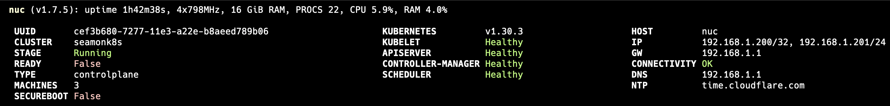
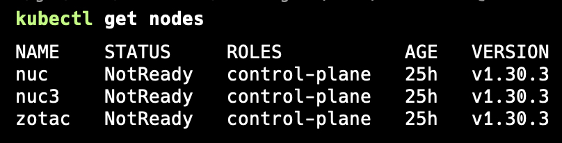
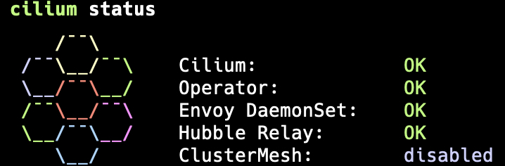

# SEAMONK8S


## How or why to use this project

This is the repo for my homelab.

## Tasks

- [ ] Reformat this README cause it stinks so far
- [x] Install steps for Talos OS
- [x] Bootstrapping the Kubernetes cluster
- [x] Managing secrets (SOPS/AGE or Sealed Secrets)
- [x] Cilium install and setup
- [ ] Get cert-manager running for TLS
- [ ] Get Prometheus and Grafana running
- [ ] Internal domain name setup
- [ ] Raspberry Pi setup

## Talos OS

I'm looking to level up my Kubernetes skills and have a few small form factor PCs laying around so I thought I'd put a cluster together to see what I could break. The first step for that is determining which OS I was going to use. I was going to go with Ubuntu since it's the OG of Kubernetes OSes but then I started looking around. In doing so, I found Talos OS which is built specifically for Kubernetes. To make it even better, it's light weight, is secure by default, and declarative on how to set it up. So here we go.

Initially, I read this [article](https://mirceanton.com/posts/2023-11-28-the-best-os-for-kubernetes/) about Talos OS and watched some of their [YouTube build videos](https://www.youtube.com/@SideroLabs/videos?view=2&sort=dd&live_view=503&shelf_id=6) on how to get started. After more digging, I also found this great [blog post](https://a-cup-of.coffee/blog/talos/) on another setup of Talos OS. I'm not going to reinvent the wheel since those three resources were enough to get me started but I will do a high level list of steps I took to get my cluster running.

1. Download the [Raspberry Pi Image Builder](https://www.raspberrypi.com/software/) and flash the USB stick with the Talos OS ISO.
1. Boot each machine off the USB stick.
1. Made sure that `talosctl` and `kubectl` were both installed on my Mac via `brew`.
1. Create the patch file `01-cni-patch.yaml` to disable the default CNI and disable kube-proxy. Cilium will be replacing these.
1. Create the patch file `02-controlplane-scheduling-patch.yaml` to enable workloads on the Control Plane nodes.
1. Run `talosctl gen secrets` to generate the cluster secrets. This file shouldn't be checked into Github till encrypted with SOPS.
1. Run `talosctl gen config seamonk8s https://192.168.1.200:6443 --with-secrets secrets.yaml --config-patch @01-cni-patch.yaml --config-patch @02-controlplane-scheduling-patch.yaml`.
1. Since I run on dissimilar hardware, copy the `controlplane.yaml` to `controlplane-nuc.yaml`, `controlplane-nuc3.yaml`, and `controlplane-zotac.yaml`. Edit the network setup and install disk to match each one's hardware configuration.
1. Copy the `talosconfig` file to `~/.talos/config`.
1. Set the Talos context so that it points to all of the control plane endpoints with `talosctl config endpoint 192.168.1.201 192.168.1.202 192.168.1.203`. 
1. Now we can bootstrap the Talos cluster. Until I get my Ubiquiti gateway, I'll have to connect to each of the nodes with a HDMI cable and see what the IP is currently set to. Hopefully soon I'll be able to statically assign these or use DHCP reservations.
Run `talosctl apply-config -f controlplane-nuc.yaml -n 192.168.1.xxx --insecure` for each of the nodes. It can take awhile for the node to become healthy, so just be patient.
1. Once the nodes become healthy, run `talosctl get members -n 192.168.1.xxx` to see the Talos cluster members.
1. Bootstrap Kubernetes with `talosctl bootstrap -n 192.168.1.xxx` and wait for all the Kubernetes services to become healthy. It should look like this when ready:

1. Get the Kubernestes context and merge it into `~/.kube/config` by running `talosctl kubeconfig -n 192.168.1.xxx`.

## Kubernetes

Now that the Kubernetes cluster is bootstrapped, it's still not ready since we set CNI to none. You can see that with `kubectl get nodes` is showing Not Ready. 

### Cilium Install

Now it's time to install [Cilium](https://docs.cilium.io/en/stable/installation/k8s-install-helm/). Cilium has instructions specifically for Talos along with the [install docs](https://www.talos.dev/v1.7/kubernetes-guides/network/deploying-cilium/) from Sidero Labs. I initially wanted to get this installed with a manifest I generated but ended up getting the error `Error: Unable to enable Hubble: release: not found`. Nothing on the internet about that error came up and I wasn't able to find a way around it. So we'll install Cilium and Hubble the CLI way.

1. Download and install `cilium-cli` and `hubble`. [Hubble](https://docs.cilium.io/en/stable/gettingstarted/hubble_intro/) is the observability plane of Cilium.
    ```bash
    brew install cilium-cli hubble
    ```
1. Install Cilium with the config listed [here(https://www.talos.dev/v1.7/kubernetes-guides/network/deploying-cilium/#without-kube-proxy)].
1. Check that Cilium is running with `cilium status --wait`.

Now let's getting Hubble running. We'll do this the easy way.
1. Run `cilium hubble enable`.
1. Do `ciliumm status` again to make sure Hubble is enabled.
    

## SOPS and AGE

I used this [guide](https://mirceanton.com/posts/doing-secrets-the-gitops-way/) to help setup [SOPS](https://github.com/getsops/sops)/[AGE](https://github.com/FiloSottile/age) to secure secrets in this repo.

The private and public key is stored on my laptop at `~/.config/sops/age/keys.txt` and in LastPass in `jknsware age key`. `.gitignore` is setup to make sure unencrypted files don't get into the repo but I do realize that it might take more vigilance than that to make sure that stays true.

A `.sops.yaml` file is in the same directory as the secrets so it knows what to encrypt and how to do it. Regex, which I'm horrible at, is used to define the files and the lines to be encrypted. 


Here's an example of how to encrypt or decrypt the files:
```bash
$ sops --encrypt talosconfig > talosconfig.encrypted

$ sops --decrypt talosconfig.encrypted > talosconfig
```

Now these files can be safely added to the repo and pushed to Github.

### Thanks

- [Talos OS](https://www.talos.dev/)
- [Chris Kirby](https://chriskirby.net), for getting me inspired to do a homelab again.